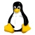

# Welcome

## Projects

- [JaMuz](JaMuz) - Keep your music in check and enjoy it too!
- [Code Samples](https://github.com/phramusca/Samples/tree/main) - Pieces of code

### Under Development

- [Cook And Freeze](https://github.com/phramusca/CookAndFreeze) - With CookAndFreeze for Android, easily manage recipients (content and frozen date) stored in your freezer (or elsewhere).
- [Rom Manager](https://github.com/phramusca/RomManager)

## Wiki en français

Bienvenue dans ce Wiki. J'y traite d'informatique, et en particulier du monde libre (Open Source).

Il s'agit plutôt d'un bloc-notes de mon expérience (professionnelle et personnelle) dans ce domaine.

### Développement

Le [Développement](wiki/Développement) de logiciels ou de sites Internet, peut se faire sous Linux, mais aussi sous Windows.

Linux est, à mon humble avis, préférable dans le monde du développement, à moins d'utiliser des solutions Microsoft, et encore de nombreux équivalents existent: Mono pour .NET, Gambas pour VB, ...

- [Java](wiki/Java)

### Linux

 Et voilà, mon PC ne tourne plus que sous [Linux](wiki/Linux) depuis 2005 !

C'est notamment [Ubuntu](wiki/Ubuntu), une des nombreuses distributions [Linux](wiki/Linux) qui m'a décidé à me séparer de [Windows](wiki/Windows) une fois pour toutes.

J'utilise maintenant [Linux Mint](https://linuxmint.com/) qui est basé sur [Ubuntu](wiki/Ubuntu) mais utilise Cinnamon comme environnement de bureau, que je préfère aux dernières version de Gnome utilisé par Ubuntu.

Les 2 sont basés sur [Debian](https://www.debian.org). Donc ce qui est vrai pour l'un l'est pour l'autre (sauf de rares exceptions spécifiques)

1. [Installation](wiki/Installation)

2. [Programmes](wiki/Programmes)

3. [Misc](wiki/Misc)

### Windows

 J'utilise (malheureusement) encore [Windows](wiki/Windows) au boulot.

Bien que [Windows](wiki/Windows) ne soit pas Open Source, il existe de nombreux logiciels libres pour cet OS.

### Android

[Android](wiki/Android) est un système d'exploitation Open Source, racheté à la société [Android](wiki/Android) par Google, basé sur un noyau [Linux](wiki/Linux). Il tourne sur de plus en plus d'équipements mobiles: smartphones, PDA, tablettes, téléviseurs, autoradios ...

### Raspberry

TODO

------------------------------------------------------------------------

*Ce site a été converti depuis [MediaWiki](wiki/MediaWiki) en utilisant [mediawiki-to-gfm](https://github.com/outofcontrol/mediawiki-to-gfm) fin 2024, lui-même migré depuis Wikini fin 2009.*
