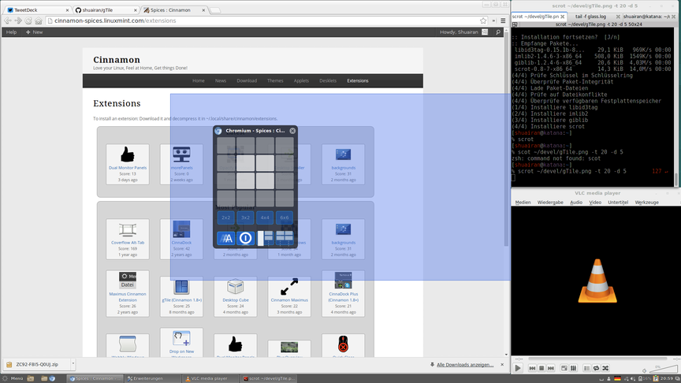

# gTile

[gTile](https://cinnamon-spices.linuxmint.com/extensions/view/76) permet de séparer les fenêtres plus finement que cinnamon par défaut.

Depuis le menu de Linux Mint, ouvrir `Extension` et installer puis configurer `gTile`
