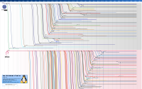

# Linux

[GNU/Linux](https://fr.wikipedia.org/wiki/Linux) est un système d'exploitation libre (open source) fondé sur le [noyau Linux](https://fr.wikipedia.org/wiki/Noyau_Linux) (kernel).

Contrairement à [Windows](../windows/README.md), Linux existe en de multiples variantes, appellées [distribution Linux](https://fr.wikipedia.org/wiki/Distribution_Linux).

Par [métonymie](https://fr.wikipedia.org/wiki/M%C3%A9tonymie), **l'usage du terme `Linux` s'est répandu pour décrire tant le noyau Linux que le système d'exploitation au sens large**

> Pour les puristes: ["Linux" ou "GNU/Linux" ?](https://fr.wikipedia.org/wiki/Linux_ou_GNU/Linux)

## Distribution Linux

Une [distribution Linux](https://fr.wikipedia.org/wiki/Distribution_Linux) (ou "distro") est un ensemble complet de logiciels qui offre un environnement prêt à l'emploi pour les utilisateurs.

Chaque distribution a ses spécificités (outils, apparence, gestionnaire de paquets) et peut être orientée vers différents types d’utilisateurs

- [Principales distributions](https://fr.wikipedia.org/wiki/Distribution_Linux#Principales_distributions)
- Informations détaillées pour toutes les distributions mais en anglais sur [distrowatch.com](http://distrowatch.com/index.php?language=FR)
- Chronologie des distributions:
  - 

### Debian-Based Distributions

Je recommande les distributions basées sur Debian, et principalement [Linux Mint](dist/Mint.md) du débutant au confirmé. C'est celle que j'utilise depuis au moins 2017. Elle est basée sur [Ubuntu](dist/Ubuntu.md) que j'utilisais avant, depuis 2005 et qui m'a décidé à me séparer de [Windows](../windows/README.md) une fois pour toutes, et qui est basée sur [Debian](https://www.debian.org).

- [Programmes](soft/README.md)
- [Système](system/README.md)

### Interfaces graphiques

L'interface graphique (ou environnement de bureau) correspond à ce que l'on voit à l'écran. Dans le cas de Windows, le noyau et l'interface sont confondus. Dans le cas d'une distribution Linux aussi, sauf que
l'on a le choix de son interface.

Plusieurs interfaces graphiques existent sous Linux, les plus connues étant:

- Gnome Shell (par défaut dans [Ubuntu](dist/Ubuntu)),
- **Cinnamon** (par et pour [Linux Mint](dist/Mint)),
- KDE (complexe mais complète)
- XFCE (légère)
- et de de nombreuses autres, que je ne connais pas personnellement.

## Tenté par l'aventure

Si tu es tenté, tu peux dès maintenant et facilement tester et/ou installer [Linux Mint](dist/Mint), [Ubuntu](dist/Ubuntu) ou une autre distribution.

Il est aussi possible d'[acheter un PC pré-installé](http://linuxpreinstalle.com/) avec Linux.

[LDLC.com](https://www.ldlc.com/) propose aussi des PCs fixe et portables sans OS, pour éviter de payer [Windows](../windows/README.md) pour rien.

## Le Monde du Libre

- <http://www.april.org/> - Promouvoir et défendre le logiciel libre
- <https://lea-linux.org/documentations/> - Léa-Linux, site d'aide pour Linux en français.
