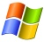

# Windows

Windows est un système d'exploitation (OS) qui se distingue de
[Linux](Linux) principalement par le fait d'être propriétaire
(non libre) et par conséquent payant (Microsoft, son éditeur n'étant pas
philanthrope). Bien d'autres différences fondamentales (ou moins)
existent entre les 2 mondes, que je ne détaillerais pas ici, mais voici
quelques pistes:

- <http://www.framablog.org/index.php/post/2008/09/02/differences-entre-linux-et-windows>
- <http://www.commentcamarche.net/faq/7283-linux-n-est-pas-windows>

## Logiciels

### Libres

Bien que Windows ne soit pas libre, il existe cependant de nombreuses
application libres (open source) sous Windows (souvent portée depuis le
monde [Linux](Linux).

Voici quelques sites pour trouver des équivalences:

- <http://www.misfu.com/equivalence-logiciels-windows-linux.html>
- <http://lesalternatives.free.fr/>
- <http://alternativeto.net/>

Et voici quelques exemples qui me paraissent intéressants:

|  |  |  |
|----|----|----|
| Site internet | Description | Semblable à |
| [wxchecksums](http://wxchecksums.sourceforge.net/) | Création de checksums (MD5, SHA-1,...) |  |
| [GIMP](http://www.gimp.org/) | Gnu Image Manipulation Program | Adobe Photoshop |
| [Sumatra PDF](http://blog.kowalczyk.info/software/sumatrapdf/) | Visionneuse de fichiers PDF | Adobe Reader (anciennement Acrobat Reader) |

### Gratuits

Voici des logiciels utiles, gratuits, mais pas libres.

|  |  |  |
|----|----|----|
| Site internet | Description | Semblable à |
| [Auslogics Disk Defrag](http://www.auslogics.com/en/software/disk-defrag/) | Défragmenteur de disques. Bien plus efficace et complet que celui par défaut de Windows. | Défragmenteur de disque Windows |
| [Page Defrag](http://www.commentcamarche.net/download/telecharger-248-pagedefrag/) | Défragmenteur de fichiers systèmes. Le défragmenteur de Windows, ni même les autres alternatives ne peuvent défragmenter les fichiers systèmes (swap, base de registre). Ce petit utilitaire, fourni par Microsoft le fait. | Aucun |
| [IceTeaReplacer](http://www.icetear.com/en/menu/home/) | Permet de rechercher (et de remplacer) du texte dans des fichiers Word 2007(docx), Excel 2007(xlsx) et Excel 2003(xls) contenus dans un répertoire donné. | Aucun |

## Trucs et Astuces

| Logiciel                     | Astuce                                                                                       | Détails                                                                                                                      |
|-----------------------------|----------------------------------------------------------------------------------------------|------------------------------------------------------------------------------------------------------------------------------|
| Excel (Microsoft Office)    | Listes de validation                                                                         | [http://www.excel-downloads.com/forum/81047-excel-liste-de-validation-dans-une-cellule.html](http://www.excel-downloads.com/forum/81047-excel-liste-de-validation-dans-une-cellule.html) |
| Excel (Microsoft Office)    | Ouvrir Excel dans des instances différentes                                                  | Open registry HKEY_CLASSES_ROOT =&gt; Excel.Sheet.8 =&gt; Shell =&gt; Open =&gt; Command The (default) value will be something like this: `"C:\Program Files (x86)\Microsoft Office\Office12\EXCEL.EXE" /e` And you'll want to append a `%1` to the end of that, making it: `"C:\Program Files (x86)\Microsoft Office\Office12\EXCEL.EXE" /e "%1"` Delete or rename the command key, which is right below the (Default) key Delete or rename the DDEexec key Excel.Sheet.8 =&gt; Excel 97-2003 file type. Excel.Sheet.12 =&gt; Excel 2007 files |
| Excel (Microsoft Office)    | Copier chaque feuille visible dans un nouveau classeur et sauvegarder le classeur avec le nom de la feuille dans un dossier nouvellement créé dans le même chemin que le classeur avec cette macro | [http://www.rondebruin.nl/copy6.htm](http://www.rondebruin.nl/copy6.htm)                                           |
| Windows                     | Liens symboliques                                                                             | [http://technet.microsoft.com/fr-fr/sysinternals/bb896768%28en-us%29.aspx](http://technet.microsoft.com/fr-fr/sysinternals/bb896768%28en-us%29.aspx) |
| Windows                     | Config réseau                                                                                | En ligne de commande: `netsh` ex: `netsh interface ip set address name="<nomDeLaConnexion>" static 172.26.175.218 255.255.255.0 none` Plus d'infos: [http://fr.wikipedia.org/wiki/Netsh](http://fr.wikipedia.org/wiki/Netsh) |
| GIMP                        | Masquer le dossier gegl dans Mes Documents (ATTRIB)                                        | [http://www.commentcamarche.net/forum/affich-15193901-supprimer-le-dossier-gegl-0-0](http://www.commentcamarche.net/forum/affich-15193901-supprimer-le-dossier-gegl-0-0) |
| Outlook (Microsoft Office)  | Fichier NK2 (fichier qui stocke les adresses de la saisie automatique)                      | Le fichier se trouve ici: Documents and settings\<User>\Application Data\Microsoft\Outlook Un éditeur: [http://www.nirsoft.net/utils/outlook_nk2_edit.html](http://www.nirsoft.net/utils/outlook_nk2_edit.html) |
| Nokia OVI Suite            | Exportation des contacts                                                                     | Utiliser "Grab My Contacts" sous: [http://www.zodus.tk/](http://www.zodus.tk/)                                         |
| Firefox                     | Comment limiter l’utilisation de mémoire RAM?                                               | [http://ceclair.fr/deboguer-firefox-comment-limiter-lutilisation-de-memoire-ram](http://ceclair.fr/deboguer-firefox-comment-limiter-lutilisation-de-memoire-ram) |
| Google Desktop              | Changer l'emplacement du répertoire “Google Desktop Data” (par défaut dans "Mes Documents") | [http://www.vanachteren.net/2008/02/16/how-to-change-the-default-google-desktop-data-index-folder/](http://www.vanachteren.net/2008/02/16/how-to-change-the-default-google-desktop-data-index-folder/) |
